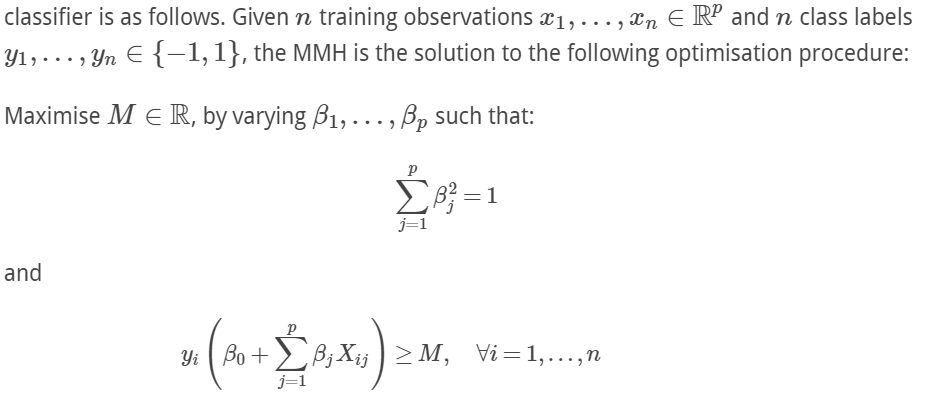
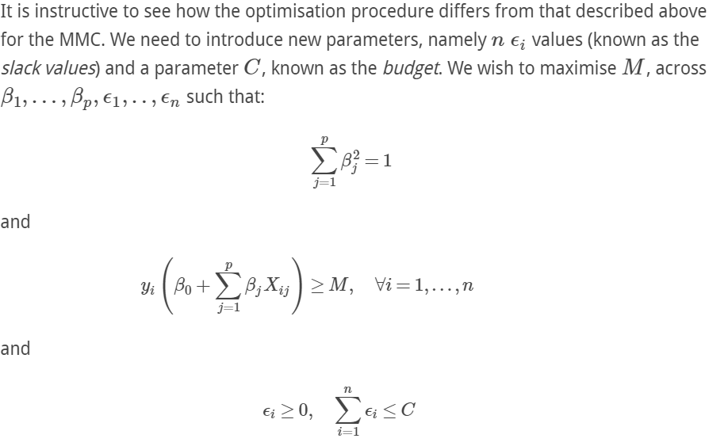
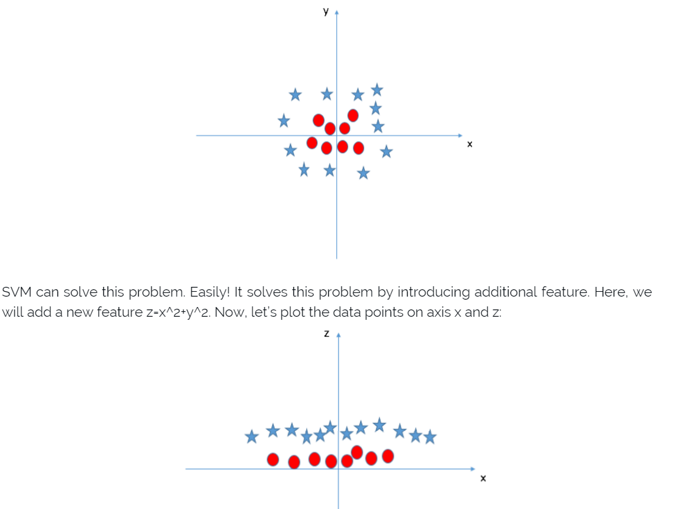

INFO 490: Advanced Data Science
===========

## Week 1: Introduction to Machine Learning

### Lesson 1: Intro to Machine Learning

- Iris Data and classification problem
    - two convenience plotting functions
        - confusion matrix (e.g. heatmap of 2d histogram using prediction and test data)
        - scatter plot (e.g. pair grid)
    - preprocessing of data
        - since sklearn does not support Pandas DataFrames, we need to extract data as numpy arrays
        - we need to use `cross_validation` module to create training and testing datasets
    - several learning algorithms
        - k-nearest neighbors
        - support vector machine
        - decision trees
        - random forest
            - an example of **emsemble learning**
            - combine decisions of a set of decision trees to make the final decision
    - cross-validation
        - repeatedly select **different training/validation datasets**, and get statistical measure of the performance of a specific algorithm
    - dimensionality reduction
        - PCA
    - clustering
        - k-means

- reading: basic concepts in machine learning
    - ref: http://machinelearningmastery.com/basic-concepts-in-machine-learning/
    - what is machine learning
        - traditional programming vs machine learning
            - 
        - key elements of machine learning
            - representation
            - evaluation
            - optimization
    - types of machine learning
        - supervised learning
        - unsupervised learning
        - semi-supervised learning
        - reinforcement learning
    - inductive learning
        - definition: given input samples {x} and output samples {f(x)}, the problem is to estimate the function f
        - it is the general theory behind supervised learning
    - some terminology
        - training sample, target function, hypothesis, concept, classifier, learner, hypothesis space, version space

- reading: a few useful things to know about machine learning
    - ref: http://homes.cs.washington.edu/~pedrod/papers/cacm12.pdf
    
### Lesson 2: Introduction to Machine Learning Pre-processing

- preprocessing includes
    - get basic info of data: `describe()`
    - drop and replace missing data: `dropna()`, `fillna()`
    - converting data to type "category" if necessary (convenient to group similar data)
    - convert datetime format using `to_datetime()`

- reading: data, learning and modeling
    - ref: http://machinelearningmastery.com/data-learning-and-modeling/
    - terminology of data
        - instance, feature, data type, datasets, training dataset, testing dataset 
    - terminology of learning
        - induction, generalization, over/under-learning, online/offline learning, supervised/unsupervised learning
    - terminology of modeling
        - model selection, inductive bias, model variance, bias-variance tradeoff

- reading: The Quartz guide to bad data
    - ref: https://github.com/Quartz/bad-data-guide

- reading: Rescaling Data for Machine Learning in Python with Scikit-Learn
    - ref: http://machinelearningmastery.com/rescaling-data-for-machine-learning-in-python-with-scikit-learn/

### Lesson 3: Introduction to Regression

- polynomial fitting
    - `polyfit`
    - overfitting issue
    - pros and cons
        - pros
            - straightforward, easy to use
        - cons
            - using **fixed criterion** and less flexible

- linear regression (LR)
    - LR with `statsmodels`
        - `statsmodels` is a Python library that implements a number of statistical methodology, often in concert with Pandas.
        - basic idea
            - use [**formula language** (defined in `statsmodels.formula.api`)](https://patsy.readthedocs.org/en/latest/formulas.html) to construct model, and pass in training data
                - an example of formula language
                ```Python
                result_noi = smf.ols(formula='y ~ x - 1', data=df).fit()  # "- 1" means no intercept
                ```
            - use `summary()` to see the fitting information (e.g. R-squared, Method, Model, std error, etc)
    - LR with `sklearn`
        - `sklearn` includes lots of different estimators, e.g. Ridge Regression, Lasso, Elastic Net, Orthogonal Matching Pursuit, Bayesian regression, Stochastic Gradient Descent, Robust regression, etc
        - basic idea
            - use `sklearn.linear_model.LinearRegression` to fit data, and use `train_test_split` to do cross-validation
    - ref: http://nbviewer.jupyter.org/urls/s3.amazonaws.com/datarobotblog/notebooks/ordinary_least_squares_in_python.ipynb


## Week 2: General Linear Models

### Lesson 1: Introduction to Multiple Variable Linear Regression

- multiple variable linear regression
    - the difference from single-variable case is to include more variable in the formula language (all other analysis is similar), e.g. 
    ```Python
    result = smf.ols(formula='aDelay ~ dDelay + dTime + np.sqrt(Distance)', data=local).fit()
    ```
    - note 
        - we could use function of a variable to fit the model, such as `np.sqrt(Distance)` in this case
        - we could also handle categorical variables, using notation `C()`, e.g.
        ```Python
        est = smf.ols(formula='chd ~ C(famhist)', data=df).fit()
        ```
        - to study interaction, we can use operator `*` (interaction term with linear terms) or `:` (interaction term only), e.g.
        ```Python
        est = smf.ols(formula='mdvis ~ hlthp * logincome', data=df).fit()
        ```

- reading: assumptions of multiple linear regression
    - ref: http://www.statisticssolutions.com/assumptions-of-multiple-linear-regression/
    - check assumptions using graphs
        - basic idea: plot residues against fitted values, plot residuals
        - ref: section 8.3 of this: https://www.openintro.org/download.php?file=os2_08&referrer=/stat/textbook/textbook_os2_chapters.php

- reading: linear regression with Python
    - ref: http://connor-johnson.com/2014/02/18/linear-regression-with-python/
    - this material covers most information given by `result.summary()`

- reading: multiple regression in Python
    - ref: http://nbviewer.jupyter.org/urls/s3.amazonaws.com/datarobotblog/notebooks/multiple_regression_in_python.ipynb

### Lesson 2: Introduction to Regularization

- example: polynomial fitting
    - firstly we use `PolynomialFeatures()` to transform data x into polynomial terms (1, x, x^2, x^3, ...) and then pass these terms into `LinearRegression()` to do fitting.  These two steps (transformation and fitting) can be pipelined using `make_pipeline()` function, see more info here: http://scikit-learn.org/stable/tutorial/statistical_inference/putting_together.html
        - code example
        ```Python
        for idx, deg in enumerate(range(1, max_deg + 1)):
            est = make_pipeline(PolynomialFeatures(deg), LinearRegression())  
            # what this pipeline does is: transform the input (1D data) into corresponding polynomial terms (1, x, x^2, etc)
            # and then pass the terms into LinearRegression() to do fitting
            est.fit(x_train[:, np.newaxis], y_train)

            plt.plot(xf, est.predict(xf[:, np.newaxis]), c=cmp[deg - 1], label='{0} Order'.format(lbls[idx]))
        ```
    - by computing the MSE of the testing data, we can see the overfitting issue, and find the optimal fitting degree
    - regularization techniques
        - Ridge regression
            - basic idea: add L2 norm of regression coefficients as the penalty term
        - Lasso regularization
            - basic idea: add L1 norm of regression coefficients as the penalty term
            - due to the properties of L1 norm, many coefficients will become 0 at the optimal solution.  So Lasso typically gives a **sparse solution**
        - elastic net
            - basic idea: combine Ridge and Lasso
            - ref: https://en.wikipedia.org/wiki/Elastic_net_regularization#Specification

- reading: Understanding the Bias-Variance Tradeoff
    - ref: http://scott.fortmann-roe.com/docs/BiasVariance.html
    - definition
        - given a model, we get different functions for different training data.  
            - **bias**: the difference between the average prediction value (given by functions with different training data) and the expected value. 
            - **variance**: the difference among different predicted values (given by functions with different training data)
    - bias-variance tradeoff
        - 

### Lesson 3: Introduction to Logistic Regression

## Week 3: Introduction to Supervised Learning

### Lesson 1: k-Nearest Neighbors

- k-nearest neighbors
    - use `KNeighborsClassifier()`
        - by default, the distance function is [Minkowski distance](https://en.wikipedia.org/wiki/Minkowski_distance)
        - by default, each neighboring point has the same weight, you can modify that in `weights` parameter
        - ref: http://scikit-learn.org/stable/modules/generated/sklearn.neighbors.KNeighborsClassifier.html
    - model evaluation
        - use `seaborn.heatmap()` to visulize **confusion matrix**
        - use `sklearn.metrics.classification_report()` to generate a report about **precision, recall, and f1-score**
            - precision: true positives / (true positives + false positives)
            - recall: true positives / (true positives + false negatives)
            - ref
                - https://en.wikipedia.org/wiki/Precision_and_recall
                - https://en.wikipedia.org/wiki/F1_score

- reading: how to evaluate machine learning models: classification metrics
    - ref: http://blog.dato.com/how-to-evaluate-machine-learning-models-part-2a-classification-metrics
    - ways of measuring classification performance
        - accuracy: number of correct predictions / number of total data points
        - per-class accuracy: average of accuracies of all classes
        - confusion matrix
        - log-loss: deals with probability values, similar to information entropy
        - AUC (Area Under the Curve)
            - the curve here is [receiver operating characteristic curce](https://en.wikipedia.org/wiki/Receiver_operating_characteristic), which illustrates the performance of a binary classifier system as its **discrimination threshold** is varied, by plotting **true positive rate (TPR)** vs. **false positive rate (FPR)**
                - note
                    - it only works for **binary classifier** system, does not work for multiple classes, how do we use it for multiple classes? one way is to use `sklearn.preprocessing.label_binarize()` to binarize the classification labels, read this: http://scikit-learn.org/stable/modules/generated/sklearn.preprocessing.binarize.html
                    - how do we determine whether an item belongs to a positive or a negative class? by comparing the score (calculated using input) with a threshold value.  If it is greater than threshold, then positive
                    - each data point on ROC curve corresponds to a threshold value
                    - as the threshold value increases, both TPR and FPR will increase

- reading: how to evaluate machine learning models: ranking and regression metrics
    - ref: http://blog.dato.com/how-to-evaluate-machine-learning-models-part-2b-ranking-and-regression-metrics
    - ranking metrics
        - precision-recall and f1-score
        - NDCG
            - main idea: assign different weights to different items (unulike precision-recall where we assign equal weights to all items)
    - regression metrics
        - RMSE
        - quantiles of errors
            - e.g. median or 90th percentile of absolute percent error
        - "almost correct" predictions
            - the percent of estimates that differ from the true value by no more than X%

### Lesson 2: Support Vector Machine

- introduction to SVM
    - three types of classifiers related to SVM
        - maximal margin classifier (MMC)
            - basic idea: use a hyperplane to segregate two classes, to maximize **margin**
            - constructing MMC
            
            - **support vectors** are those that affect the boundary lines, in this case, the support vectors are points located exactly on the edge of the margin
        - support vector classifier (SVC)
            - motivation: relax the requirement that a separating hyperplane will perfectly separate every training observation on the correct side of the line, using what is called a **soft margin** 
            - constructing SVC
            
        - support vector machine (SVM)
            - motivation: how to deal with non-linear decision boundaries?
                - one way is to construct additional non-linear features from existing features, as we did in linear regression, an example is give below
                    - the problem with this method is it can be quite **computationally expensive**
                    
                - another way is the **kernel trick**
                    - kernel trick is based on the fact that the SVC classifier **only depends on inner products** of observations, not observations themselves, the classifier could be written as $f(x)=\beta_0+\sum_{i=1}^n {\alpha_i \langle x,x_i \rangle}$
                    - we can see inner product as the **similarity function**, and we can replace this with another kernel function $K(x_i, x_k)$, one example is radial kernel, which decays exponentially with the distance, so it has **extremely localized behavior**, see [here](https://www.quantstart.com/articles/Support-Vector-Machines-A-Guide-for-Beginners)
                    - kernel trick is much more efficient than adding features approach
    - ref
        - https://www.quantstart.com/articles/Support-Vector-Machines-A-Guide-for-Beginners
        - Chapter 9 of Introduction to Statistical Learning
        - http://www.analyticsvidhya.com/blog/2015/10/understaing-support-vector-machine-example-code/

### Lesson 3: Naive Bayes

- reading: sklearn documentation of Naive Bayes algorithm
    - ref: http://scikit-learn.org/stable/modules/naive_bayes.html
    - this is a very good resource for introduction to NB algorithm

- reading: 6 easy steps to learn Naive Bayes algorithm
    - ref: http://www.analyticsvidhya.com/blog/2015/09/naive-bayes-explained/
    - what is NB algorithm?
        - theory: $p(c|x) = p(x|c) p(c)/p(x)$
        - assumption: independence among predictors
        - it is particularly useful for **very large data sets**

## Week 4: Tree Algorithms and Ensemble Techniques

### Lesson 1: Decision Trees

- intro to decision trees
    - basic idea: construct a decision tree by **recursively splitting** a data set into new groupings based on a **statistical measure (e.g. histogram)** of the data along each different dimension 

- reading: A Visual Introduction to Machine Learning
    - ref: http://www.r2d3.us/visual-intro-to-machine-learning-part-1/
    - this is a very nice visualization to decision tree algorithm

### Lesson 2: Ensemble Techniques: Bagging

- random forest
    - basic idea: build a set of decision trees, and combine predictions from the different trees statistically to make a final prediction, it is an example of **bagging approach of ensemble learning**
        - **Bagging** means that when building each subsequent tree, we don’t look at the earlier trees, while in boosting we consider the earlier trees and strive to compensate for their weaknesses
        - ref: http://fastml.com/intro-to-random-forests/
    - steps
        - randomly divide data into several datasets, and train multiple decision trees
        - Each tree is grown to the largest extent possible and there is no pruning
        - Predict new data by aggregating the predictions of the ntree trees (**majority votes for classification, average for regression**)
    - tuning random forest
        - the most important parameter is the number of trees
            - usually, the more, the better, because the multitude of trees serves to **reduce variance**
            - ref: http://fastml.com/what-is-better-gradient-boosted-trees-or-random-forest/
    - ref: http://www.analyticsvidhya.com/blog/2015/09/random-forest-algorithm-multiple-challenges/

### Lesson 3: Ensemble Techniques: Boosting

- basic idea: build new better estimators based on previous estimators

## Week 5: Introduction to Unsupervised Learning

### Lesson 1: Introduction to Dimension Reduction

- PCA
    - basic idea
        - given zero-mean (by shifting the center of data) data set $X = [x_1, x_2, ..., x_n]$, where $x_i = \left[x_{1i}, ..., x_{mi}\right]^T$, a **orthogonal transformation** $W$, let $Y = WX$, $Y$ is the transformed data. find $W$ such that sum of squares of the 1st component of y's reaches maximum, and sum of squares of 2nd component reaches its maximum after eliminating 1st component, and ...
        - PCA does dimension reduction by ensuring that first few components **capture most of variance** of the data
            - metric: fraction of explained variance
    - PCA using `sklearn`
        - get information of PCA transformation 
            - `explained_variance_ratio_`
            - `components_`: transformation coefficients
        - reconstruction using first few componnets
        ```python
        pca = PCA(n_components, copy=True)
        tx = pca.fit_transform(x)
        hd.plot_numbers(pca.inverse_transform(tx)[0:10])
        ```
    - calculation of PCA
        - calculate covariance matrix, and find its eigenvalues and eigenvectors
        - diagonize the covariance matrix, sort all these components based on eigenvalues
        - pick first few components to form a transformation matrix and do transformation
    - note
        - PCA is often used together with other machine learning techniques, as a **preprocessing** method to compress data
        - scaling in one dimension of data may affect the PCA result, since it affects the covariance matrix
    - ref
        - http://sebastianraschka.com/Articles/2014_pca_step_by_step.html
        - http://www.lauradhamilton.com/introduction-to-principal-component-analysis-pca

### Lesson 2: Introduction to Clustering

- introduction to clustering
    - several clustering algorithms
        - Connectivity based clustering (hierarchical clustering)
        - Centroid-based clustering
        - Distribution-based clustering
        - Density-based clustering
    - ref
        - https://en.wikipedia.org/wiki/Cluster_analysis

- K-means
    - basic idea
        - step 1 (initialization): choose the number of classes to be k, pick k centroids (say, randomly)
        - step 2 (reassign points): assign every point to the cluster whose centroid is nearest to it
        - step 3 (update centroid): calculate center of all points in the cluster, as its new centroid, go to step 2, repeat until converge
    - properties
        - convergence
            - it is guaranteed to converge
        - uniqueness
            - the result may depend on the initial conditions, e.g. if we apply k-means with k = 4 to 3 clearly separate clusters, the result may be not unique
    - ref
        - http://www.naftaliharris.com/blog/visualizing-k-means-clustering/ (a very nice visualizaiton)

- DBSCAN
    - basic idea
        - we choose two parameters, a radius epsilon, and number of minPoints n
        - several concepts
            - core point
            - reachable (not a symmetric relation)
            - density-connected (a symmetric relation)
        - all mutually density-connected points form a cluster
        - points that are not density-connected to any other point are **outliers**
    - comparison with k-means
        - see [wiki](https://en.wikipedia.org/wiki/DBSCAN)
    - ref
        - https://en.wikipedia.org/wiki/DBSCAN
        - http://www.naftaliharris.com/blog/visualizing-dbscan-clustering/ (a nice visualization)

### Lesson 3: Density Estimation

- ref
    - https://en.wikipedia.org/wiki/Density_estimation
    - http://ned.ipac.caltech.edu/level5/March02/Silverman/Silver_contents.html
    - http://stanford.edu/~mwaskom/software/seaborn/tutorial/distributions.html
    - http://www.lancs.ac.uk/~struijke/density/index.html

## Week 6: Machine Learning Special Topics

### Lesson 1: Introduction to Recommender Systems

- basic idea
    - find similar users using some metrics, e.g. [cosine similarity](https://en.wikipedia.org/wiki/Cosine_similarity)
    - do recommendations based on the similar users

- reading: Recommender systems, Part 1: Introduction to approaches and algorithms
    - ref: http://www.ibm.com/developerworks/library/os-recommender1/index.html
    - basic approaches
        - collaborative filtering
        - content-based filtering
        - hybrids
    - algorithms of recommender systems
    - challenges with recommender systems
        - non-typical behavior
        - scalability
        - privacy-protection considerations

### Lesson 2: Introduction to Anomaly Detection

- basic idea
    - visual analysis
    - statistical analysis
        - calculate mean/std, trimmed mean/std (which are less sensitive to outliers)
    - cluster analysis
        - we can use `DBSCAN` to find clusters, and identify noise points with `label = -1`
    - classification analysis

- ref
    - https://en.wikipedia.org/wiki/Anomaly_detection
    - http://www.itl.nist.gov/div898/handbook/eda/section3/eda35h.htm

### Lesson 3: Introduction to Practical Concepts

- feature scaling

- feature selection
    - motivation
        - to reduce amount of data we need to process, one way is to apply dimension reduction techniques, e.g. PCA.  But when the raw data are too large (even for doing dimension reduction), it might be helpful to first select some of the features, before doing any processing.
    - methods
        - [recursive feature elimination](http://scikit-learn.org/stable/modules/feature_selection.html#recursive-feature-elimination)
            - basic idea
                - train the data with an external estimator
                - eliminate the feature with smallest weight (related to the estimator)
                - repeat until the desired number of features is reached
        - [random forest classifier](http://scikit-learn.org/stable/modules/feature_selection.html#tree-based-feature-selection)
            - basic idea
                - build RFC by randomly select features for each tree, and RFC will compute the overall importance of each feature, which is used for feature selection 
            - ref
                - http://scikit-learn.org/stable/auto_examples/ensemble/plot_forest_importances.html#example-ensemble-plot-forest-importances-py
                - http://scikit-learn.org/stable/modules/generated/sklearn.ensemble.RandomForestClassifier.html
    - ref
        - https://en.wikipedia.org/wiki/Feature_selection

- pipeline
    - package multiple machine learning techniques together, similar to Linux command line pipeline

- cross validation
    - several types
        - `KFold`, `StratifiedKFold`, `LeaveOneOut`, `ShuffleSplit`
    
- grid search
    - basic idea
        - use `GridSearchCV` object to perform a grid search to tune **hyperparameters** (e.g. learning rate for neural network, `eps` and `min_samples` for DBSCAN) for a machine learning model
        - ref
            - http://scikit-learn.org/stable/modules/generated/sklearn.grid_search.GridSearchCV.html

- validation/learning curves
    - basic idea
        - use `sklearn.learning_curve.validation_curve` to plot training score curve and validation score curve

## Week 7: Introduction to Text Analysis

### Lesson 1: Introduction to Text Analysis